# Benchmark results

This file summarizes benchmarks of different implementations.

# Summary

## Sample size = 100 elements

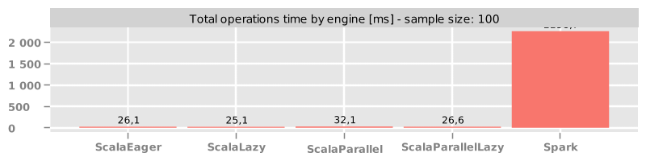

## Sample size = 1000 elements

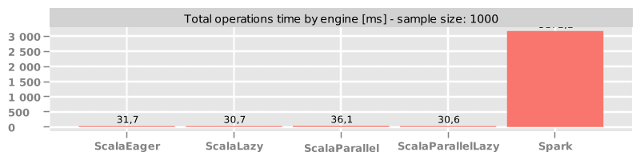

## Sample size = 10 elements

## Sample size = 100000 elements

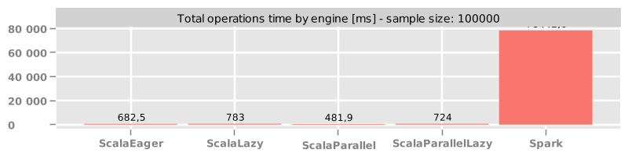

# Raw data

## RDD

### Sample size = 10 elements

#### Operations: basic
|Operation|ScalaEager|ScalaLazy|ScalaParallel|ScalaParallelLazy|Spark|
|--|--|--|--|--|--|
|RDD.take()|0.001 (0)%|0.001 (0)%|0.031 (0)%|0.002 (0)%|7.373 (100)%|
|RDD.zipWithIndex()|0.04 (1)%|0.053 (1)%|0.058 (1)%|0.018 (0)%|6.738 (100)%|
|RDD.zip()|0.007 (0)%|0.012 (0)%|0.137 (1)%|0.007 (0)%|10.288 (100)%|
|RDD.filter()|0.004 (0)%|0.003 (0)%|0.075 (1)%|0.007 (0)%|7.615 (100)%|
|RDD.count()|0.001 (0)%|0.001 (0)%|0.002 (0)%|0.002 (0)%|7.934 (100)%|
|RDD.union()|0.003 (0)%|0.004 (0)%|0.153 (2)%|0.01 (0)%|8.366 (100)%|
|RDD.flatMap()|0.012 (0)%|0.014 (0)%|0.109 (2)%|0.012 (0)%|7.013 (100)%|
|RDD.map()|0.005 (0)%|0.001 (0)%|0.077 (1)%|0.003 (0)%|7.039 (100)%|
|RDD.distinct()|0.005 (0)%|0.008 (0)%|0.04 (0)%|0.004 (0)%|17.946 (100)%|
|RDD.sortBy()|0.011 (0)%|0.015 (0)%|0.046 (0)%|0.005 (0)%|14.548 (100)%|

#### Operations: complex
|Operation|ScalaEager|ScalaLazy|ScalaParallel|ScalaParallelLazy|Spark|
|--|--|--|--|--|--|
|RDD.map().map().map()|0.013 (0)%|0.003 (0)%|0.169 (2)%|0.004 (0)%|7.844 (100)%|
|RDD.map().reduce()|0.01 (0)%|0.005 (0)%|0.051 (1)%|0.005 (0)%|5.731 (100)%|

### Sample size = 100 elements

#### Operations: basic
|Operation|ScalaEager|ScalaLazy|ScalaParallel|ScalaParallelLazy|Spark|
|--|--|--|--|--|--|
|RDD.sortBy()|0.062 (0)%|0.065 (0)%|0.083 (0)%|0.065 (0)%|16.889 (100)%|
|RDD.union()|0.01 (0)%|0.03 (0)%|0.104 (1)%|0.018 (0)%|9.765 (100)%|
|RDD.flatMap()|0.043 (1)%|0.045 (1)%|0.139 (2)%|0.023 (0)%|7.397 (100)%|
|RDD.count()|0.0 (0)%|0.0 (0)%|0.0 (0)%|0.0 (0)%|5.356 (100)%|
|RDD.distinct()|0.014 (0)%|0.023 (0)%|0.071 (0)%|0.023 (0)%|18.528 (100)%|
|RDD.filter()|0.004 (0)%|0.01 (0)%|0.123 (2)%|0.004 (0)%|7.284 (100)%|
|RDD.take()|0.0 (0)%|0.001 (0)%|0.054 (1)%|0.001 (0)%|7.026 (100)%|
|RDD.zipWithIndex()|0.05 (1)%|0.082 (1)%|0.085 (1)%|0.016 (0)%|6.97 (100)%|
|RDD.map()|0.006 (0)%|0.004 (0)%|0.112 (1)%|0.009 (0)%|7.73 (100)%|
|RDD.zip()|0.012 (0)%|0.025 (0)%|0.144 (2)%|0.022 (0)%|8.452 (100)%|

#### Operations: complex
|Operation|ScalaEager|ScalaLazy|ScalaParallel|ScalaParallelLazy|Spark|
|--|--|--|--|--|--|
|RDD.map().map().map()|0.025 (0)%|0.015 (0)%|0.229 (3)%|0.017 (0)%|7.986 (100)%|
|RDD.map().reduce()|0.019 (0)%|0.005 (0)%|0.158 (3)%|0.011 (0)%|6.238 (100)%|

### Sample size = 1000 elements

#### Operations: basic
|Operation|ScalaEager|ScalaLazy|ScalaParallel|ScalaParallelLazy|Spark|
|--|--|--|--|--|--|
|RDD.distinct()|0.191 (1)%|0.279 (1)%|0.598 (2)%|0.351 (1)%|32.64 (100)%|
|RDD.map()|0.05 (1)%|0.035 (0)%|0.154 (2)%|0.044 (1)%|8.437 (100)%|
|RDD.flatMap()|0.597 (6)%|0.526 (5)%|0.358 (3)%|0.201 (2)%|10.527 (100)%|
|RDD.zipWithIndex()|0.08 (1)%|0.085 (1)%|0.169 (1)%|0.078 (1)%|11.643 (100)%|
|RDD.union()|0.092 (1)%|0.164 (1)%|0.451 (3)%|0.233 (2)%|13.423 (100)%|
|RDD.sortBy()|0.65 (2)%|0.463 (2)%|0.384 (1)%|0.4 (1)%|30.83 (100)%|
|RDD.count()|0.0 (0)%|0.0 (0)%|0.0 (0)%|0.0 (0)%|6.376 (100)%|
|RDD.zip()|0.053 (0)%|0.056 (0)%|0.251 (2)%|0.108 (1)%|11.551 (100)%|
|RDD.take()|0.0 (0)%|0.002 (0)%|0.034 (0)%|0.001 (0)%|7.768 (100)%|
|RDD.filter()|0.036 (0)%|0.043 (0)%|0.17 (2)%|0.04 (0)%|8.794 (100)%|

#### Operations: complex
|Operation|ScalaEager|ScalaLazy|ScalaParallel|ScalaParallelLazy|Spark|
|--|--|--|--|--|--|
|RDD.map().map().map()|0.129 (1)%|0.086 (1)%|0.403 (4)%|0.1 (1)%|9.081 (100)%|
|RDD.map().reduce()|0.061 (1)%|0.046 (1)%|0.205 (3)%|0.058 (1)%|7.128 (100)%|

### Sample size = 100000 elements

#### Operations: basic
|Operation|ScalaEager|ScalaLazy|ScalaParallel|ScalaParallelLazy|Spark|
|--|--|--|--|--|--|
|RDD.flatMap()|51.975 (12)%|67.87 (15)%|23.28 (5)%|35.565 (8)%|438.691 (100)%|
|RDD.sortBy()|45.564 (6)%|58.688 (7)%|39.826 (5)%|52.423 (7)%|784.586 (100)%|
|RDD.count()|0.001 (0)%|0.002 (0)%|0.002 (0)%|0.002 (0)%|173.631 (100)%|
|RDD.take()|0.003 (0)%|0.013 (0)%|0.096 (0)%|0.032 (0)%|161.786 (100)%|
|RDD.map()|6.701 (4)%|6.908 (4)%|7.99 (4)%|8.406 (5)%|182.35 (100)%|
|RDD.union()|7.788 (1)%|15.692 (2)%|5.958 (1)%|17.147 (3)%|655.888 (100)%|
|RDD.zip()|8.227 (2)%|3.444 (1)%|7.148 (1)%|4.961 (1)%|518.214 (100)%|
|RDD.zipWithIndex()|6.209 (1)%|7.164 (1)%|9.547 (2)%|9.323 (2)%|525.995 (100)%|
|RDD.filter()|5.865 (2)%|9.471 (4)%|5.016 (2)%|10.531 (4)%|265.274 (100)%|
|RDD.distinct()|28.212 (3)%|40.114 (4)%|27.999 (3)%|37.155 (4)%|1061.363 (100)%|

#### Operations: complex
|Operation|ScalaEager|ScalaLazy|ScalaParallel|ScalaParallelLazy|Spark|
|--|--|--|--|--|--|
|RDD.map().reduce()|6.189 (4)%|7.717 (5)%|5.356 (3)%|8.228 (5)%|170.874 (100)%|
|RDD.map().map().map()|10.047 (5)%|10.536 (6)%|10.657 (6)%|16.538 (9)%|185.275 (100)%|

## DataSet

### Sample size = 10 elements

#### Operations: basic
|Operation|ScalaEager|ScalaLazy|ScalaParallel|ScalaParallelLazy|Spark|
|--|--|--|--|--|--|
|DataSet.filter()|0.004 (0)%|0.015 (0)%|0.469 (2)%|0.018 (0)%|18.898 (100)%|
|DataSet.distinct()|0.015 (0)%|0.024 (0)%|0.452 (0)%|0.039 (0)%|476.069 (100)%|
|DataSet.limit()|0.002 (0)%|0.011 (0)%|0.091 (3)%|0.019 (1)%|3.481 (100)%|
|DataSet.count()|0.001 (0)%|0.002 (0)%|0.001 (0)%|0.002 (0)%|47.053 (100)%|
|DataSet.flatMap()|9.802 (37)%|6.449 (24)%|5.639 (21)%|4.588 (17)%|26.553 (100)%|
|DataSet.union()|7.135 (37)%|8.152 (42)%|7.039 (37)%|4.395 (23)%|19.19 (100)%|
|DataSet.take()|0.002 (0)%|0.038 (2)%|0.077 (3)%|0.01 (0)%|2.307 (100)%|
|DataSet.map()|0.843 (5)%|0.656 (4)%|1.251 (7)%|0.714 (4)%|16.749 (100)%|

#### Operations: complex
|Operation|ScalaEager|ScalaLazy|ScalaParallel|ScalaParallelLazy|Spark|
|--|--|--|--|--|--|
|DataSet.groupByKey().mapGroups()|6.596 (1)%|8.027 (2)%|8.368 (2)%|5.804 (1)%|488.057 (100)%|
|DataSet.groupByKey().count()|0.799 (0)%|0.959 (0)%|2.09 (0)%|0.829 (0)%|480.008 (100)%|
|DataSet.map().map().map()|1.931 (7)%|2.216 (8)%|3.753 (14)%|3.395 (13)%|26.624 (100)%|
|DataSet.map().filter().groupByKey().mapGroups()|9.941 (2)%|9.123 (2)%|9.601 (2)%|10.345 (2)%|511.317 (100)%|
|DataSet.map().reduce()|1.041 (5)%|1.149 (6)%|1.094 (5)%|0.768 (4)%|20.801 (100)%|

### Sample size = 100 elements

#### Operations: basic
|Operation|ScalaEager|ScalaLazy|ScalaParallel|ScalaParallelLazy|Spark|
|--|--|--|--|--|--|
|DataSet.limit()|0.001 (0)%|0.003 (0)%|0.041 (1)%|0.007 (0)%|3.132 (100)%|
|DataSet.union()|3.732 (20)%|3.779 (20)%|4.367 (23)%|3.846 (20)%|19.089 (100)%|
|DataSet.map()|0.639 (4)%|0.645 (4)%|1.084 (7)%|0.721 (5)%|15.565 (100)%|
|DataSet.flatMap()|3.776 (17)%|3.742 (17)%|4.218 (19)%|3.839 (17)%|22.393 (100)%|
|DataSet.count()|0.0 (0)%|0.0 (0)%|0.0 (0)%|0.0 (0)%|34.628 (100)%|
|DataSet.distinct()|0.028 (0)%|0.044 (0)%|0.252 (0)%|0.05 (0)%|452.536 (100)%|
|DataSet.take()|0.002 (0)%|0.003 (0)%|0.036 (2)%|0.005 (0)%|2.224 (100)%|
|DataSet.filter()|0.004 (0)%|0.031 (0)%|0.189 (1)%|0.008 (0)%|15.717 (100)%|

#### Operations: complex
|Operation|ScalaEager|ScalaLazy|ScalaParallel|ScalaParallelLazy|Spark|
|--|--|--|--|--|--|
|DataSet.map().reduce()|0.641 (5)%|0.643 (5)%|0.993 (7)%|0.713 (5)%|13.432 (100)%|
|DataSet.groupByKey().count()|0.752 (0)%|0.726 (0)%|1.732 (0)%|0.821 (0)%|496.707 (100)%|
|DataSet.groupByKey().mapGroups()|5.277 (1)%|4.921 (1)%|5.936 (1)%|4.803 (1)%|521.733 (100)%|
|DataSet.map().map().map()|1.892 (8)%|1.909 (8)%|2.506 (11)%|1.906 (8)%|23.006 (100)%|
|DataSet.map().filter().groupByKey().mapGroups()|9.149 (2)%|8.309 (2)%|9.435 (2)%|9.643 (2)%|528.935 (100)%|

### Sample size = 1000 elements

#### Operations: basic
|Operation|ScalaEager|ScalaLazy|ScalaParallel|ScalaParallelLazy|Spark|
|--|--|--|--|--|--|
|DataSet.map()|0.686 (3)%|0.67 (3)%|0.939 (4)%|0.915 (4)%|23.167 (100)%|
|DataSet.count()|0.0 (0)%|0.0 (0)%|0.0 (0)%|0.0 (0)%|30.962 (100)%|
|DataSet.distinct()|0.23 (0)%|0.296 (0)%|0.258 (0)%|0.362 (0)%|653.526 (100)%|
|DataSet.filter()|0.037 (0)%|0.133 (1)%|0.132 (1)%|0.042 (0)%|24.553 (100)%|
|DataSet.flatMap()|4.5 (13)%|5.613 (16)%|5.35 (15)%|4.373 (12)%|35.646 (100)%|
|DataSet.limit()|0.001 (0)%|0.001 (0)%|0.031 (0)%|0.002 (0)%|7.569 (100)%|
|DataSet.take()|0.001 (0)%|0.002 (0)%|0.029 (0)%|0.002 (0)%|6.861 (100)%|
|DataSet.union()|4.282 (14)%|3.756 (12)%|4.174 (13)%|3.792 (12)%|31.302 (100)%|

#### Operations: complex
|Operation|ScalaEager|ScalaLazy|ScalaParallel|ScalaParallelLazy|Spark|
|--|--|--|--|--|--|
|DataSet.map().reduce()|0.69 (3)%|0.673 (3)%|1.529 (7)%|0.673 (3)%|20.746 (100)%|
|DataSet.groupByKey().mapGroups()|6.104 (1)%|5.811 (1)%|5.954 (1)%|6.715 (1)%|730.138 (100)%|
|DataSet.map().filter().groupByKey().mapGroups()|9.755 (1)%|8.542 (1)%|10.42 (1)%|8.785 (1)%|743.158 (100)%|
|DataSet.map().map().map()|2.153 (7)%|1.989 (6)%|2.671 (9)%|2.04 (7)%|30.818 (100)%|
|DataSet.groupByKey().count()|1.347 (0)%|1.387 (0)%|1.454 (0)%|1.297 (0)%|675.576 (100)%|

### Sample size = 100000 elements

#### Operations: basic
|Operation|ScalaEager|ScalaLazy|ScalaParallel|ScalaParallelLazy|Spark|
|--|--|--|--|--|--|
|DataSet.map()|7.434 (1)%|9.346 (1)%|14.56 (1)%|9.342 (1)%|1081.195 (100)%|
|DataSet.union()|12.838 (1)%|21.828 (1)%|13.354 (1)%|22.727 (1)%|1809.351 (100)%|
|DataSet.filter()|5.009 (0)%|11.68 (1)%|9.443 (1)%|6.254 (1)%|1108.817 (100)%|
|DataSet.flatMap()|77.111 (4)%|103.853 (5)%|44.539 (2)%|46.419 (2)%|2041.143 (100)%|
|DataSet.count()|0.002 (0)%|0.003 (0)%|0.002 (0)%|0.002 (0)%|895.142 (100)%|
|DataSet.distinct()|27.881 (0)%|28.548 (0)%|29.277 (0)%|30.373 (0)%|16020.734 (100)%|
|DataSet.take()|0.003 (0)%|0.013 (0)%|0.089 (0)%|0.019 (0)%|675.497 (100)%|
|DataSet.limit()|0.005 (0)%|0.024 (0)%|0.176 (0)%|0.038 (0)%|662.274 (100)%|

#### Operations: complex
|Operation|ScalaEager|ScalaLazy|ScalaParallel|ScalaParallelLazy|Spark|
|--|--|--|--|--|--|
|DataSet.map().map().map()|13.468 (1)%|13.702 (1)%|16.632 (1)%|16.626 (1)%|1546.064 (100)%|
|DataSet.groupByKey().mapGroups()|199.618 (1)%|199.097 (1)%|92.222 (1)%|205.046 (1)%|15556.168 (100)%|
|DataSet.map().filter().groupByKey().mapGroups()|75.209 (0)%|68.474 (0)%|48.556 (0)%|77.966 (1)%|15585.99 (100)%|
|DataSet.groupByKey().count()|80.221 (1)%|89.514 (1)%|62.506 (0)%|98.563 (1)%|15303.637 (100)%|
|DataSet.map().reduce()|6.884 (1)%|9.26 (1)%|7.706 (1)%|10.365 (1)%|927.849 (100)%|

# Comparing Scala implementations

## RDD

### Sample size = 10 elements

#### Operations: basic

#### Operations: complex
.reduce_10.png)

.map().map_10.png)

### Sample size = 100 elements

#### Operations: basic

#### Operations: complex
.map().map_100.png)

.reduce_100.png)

### Sample size = 1000 elements

#### Operations: basic

#### Operations: complex
.reduce_1000.png)

.map().map_1000.png)

### Sample size = 100000 elements

#### Operations: basic
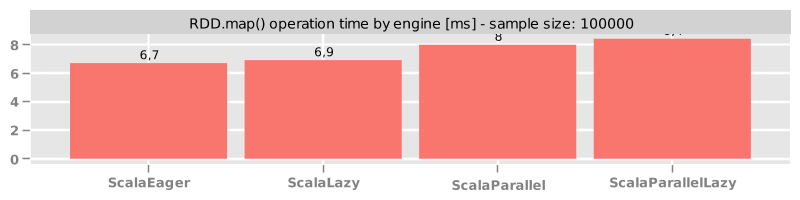

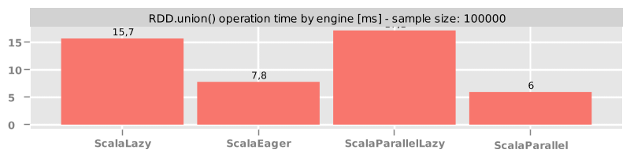

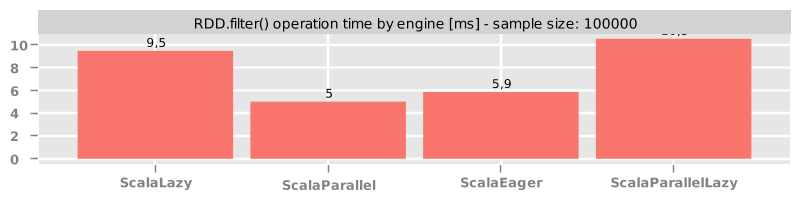

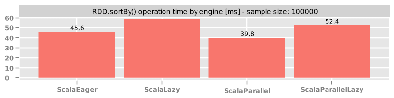

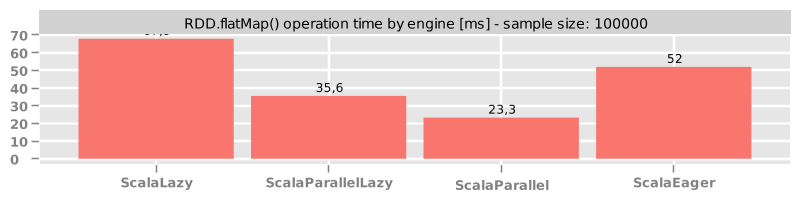

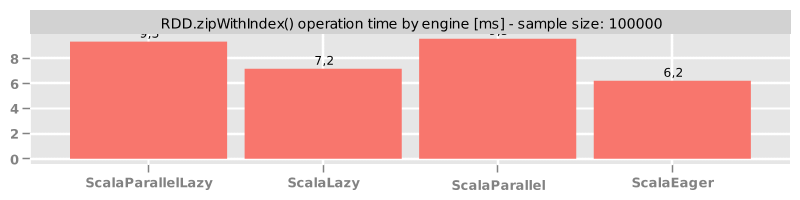

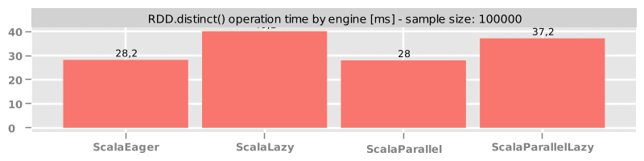

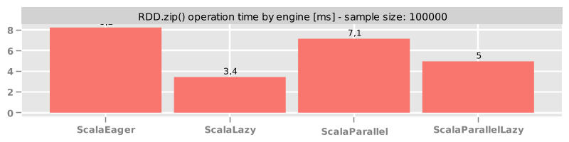

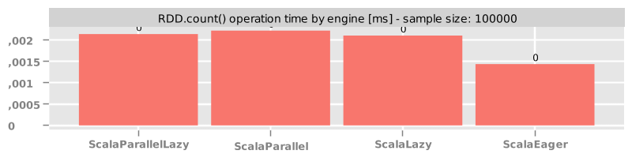

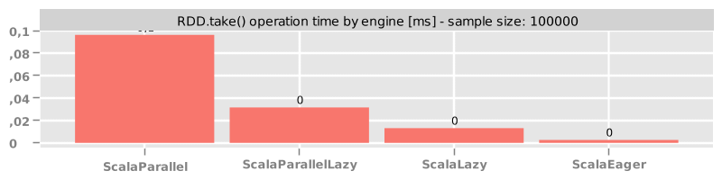

#### Operations: complex
.map().map_100000.png)

.reduce_100000.png)

## DataSet

### Sample size = 10 elements

#### Operations: basic

#### Operations: complex
.count_10.png)

.mapGroups_10.png)

.reduce_10.png)

.map().map_10.png)

.filter().groupByKey().mapGroups_10.png)

### Sample size = 100 elements

#### Operations: basic

#### Operations: complex
.count_100.png)

.reduce_100.png)

.map().map_100.png)

.filter().groupByKey().mapGroups_100.png)

.mapGroups_100.png)

### Sample size = 1000 elements

#### Operations: basic

#### Operations: complex
.filter().groupByKey().mapGroups_1000.png)

.mapGroups_1000.png)

.reduce_1000.png)

.map().map_1000.png)

.count_1000.png)

### Sample size = 100000 elements

#### Operations: basic
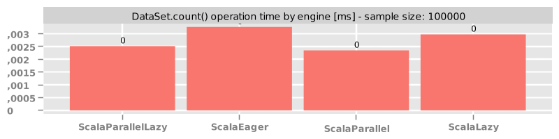

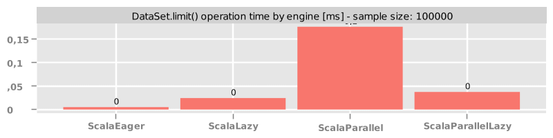

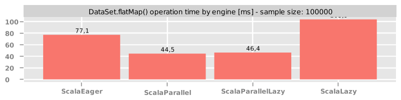

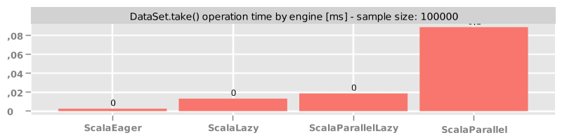

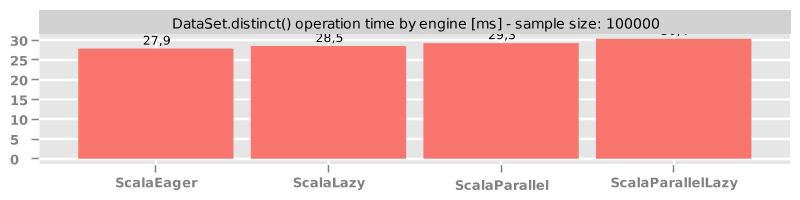

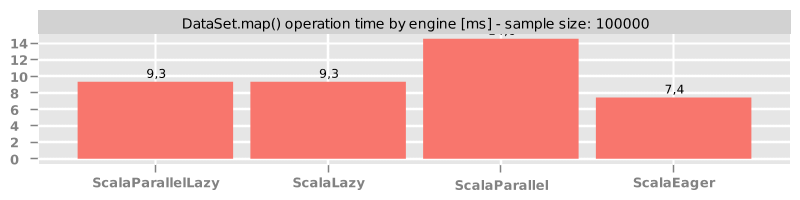

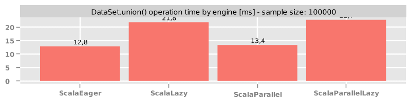

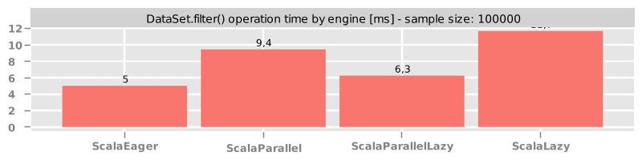

#### Operations: complex
.filter().groupByKey().mapGroups_100000.png)

.count_100000.png)

.map().map_100000.png)

.reduce_100000.png)

.mapGroups_100000.png)

