# Benchmark results

# Raw data

## RDD

### Sample size = 10 elements

|Operation|ScalaEager|ScalaLazy|ScalaParallel|ScalaParallelLazy|Spark|
|--|--|--|--|--|--|
|RDD.count()|0.001 (0)%|0.001 (0)%|0.001 (0)%|0.001 (0)%|5.687 (100)%|
|RDD.distinct()|0.002 (0)%|0.003 (0)%|0.039 (0)%|0.006 (0)%|15.546 (100)%|
|RDD.filter()|0.004 (0)%|0.01 (0)%|0.105 (2)%|0.006 (0)%|6.375 (100)%|
|RDD.flatMap()|0.008 (0)%|0.014 (0)%|0.139 (2)%|0.012 (0)%|6.8 (100)%|
|RDD.map()|0.005 (0)%|0.002 (0)%|0.04 (1)%|0.003 (0)%|6.799 (100)%|
|RDD.map().reduce()|0.01 (0)%|0.007 (0)%|0.064 (1)%|0.005 (0)%|5.371 (100)%|
|RDD.sortBy()|0.012 (0)%|0.016 (0)%|0.051 (0)%|0.017 (0)%|15.37 (100)%|
|RDD.take()|0.001 (0)%|0.006 (0)%|0.037 (1)%|0.003 (0)%|7.141 (100)%|
|RDD.union()|0.002 (0)%|0.005 (0)%|0.112 (1)%|0.005 (0)%|8.707 (100)%|
|RDD.zip()|0.004 (0)%|0.01 (0)%|0.201 (2)%|0.005 (0)%|8.269 (100)%|
|RDD.zipWithIndex()|0.035 (1)%|0.057 (1)%|0.076 (1)%|0.023 (0)%|6.492 (100)%|

### Sample size = 100 elements

|Operation|ScalaEager|ScalaLazy|ScalaParallel|ScalaParallelLazy|Spark|
|--|--|--|--|--|--|
|RDD.count()|0.0 (0)%|0.0 (0)%|0.0 (0)%|0.0 (0)%|4.656 (100)%|
|RDD.distinct()|0.013 (0)%|0.02 (0)%|0.073 (0)%|0.028 (0)%|19.613 (100)%|
|RDD.filter()|0.004 (0)%|0.008 (0)%|0.139 (2)%|0.008 (0)%|7.374 (100)%|
|RDD.flatMap()|0.042 (1)%|0.045 (1)%|0.178 (3)%|0.022 (0)%|7.059 (100)%|
|RDD.map()|0.005 (0)%|0.004 (0)%|0.115 (2)%|0.006 (0)%|7.098 (100)%|
|RDD.map().reduce()|0.006 (0)%|0.005 (0)%|0.066 (1)%|0.005 (0)%|5.756 (100)%|
|RDD.sortBy()|0.075 (0)%|0.058 (0)%|0.084 (0)%|0.039 (0)%|18.906 (100)%|
|RDD.take()|0.001 (0)%|0.002 (0)%|0.038 (0)%|0.002 (0)%|7.9 (100)%|
|RDD.union()|0.01 (0)%|0.018 (0)%|0.151 (2)%|0.032 (0)%|8.459 (100)%|
|RDD.zip()|0.006 (0)%|0.013 (0)%|0.195 (3)%|0.008 (0)%|7.573 (100)%|
|RDD.zipWithIndex()|0.013 (0)%|0.015 (0)%|0.071 (1)%|0.01 (0)%|6.004 (100)%|

### Sample size = 1000 elements

|Operation|ScalaEager|ScalaLazy|ScalaParallel|ScalaParallelLazy|Spark|
|--|--|--|--|--|--|
|RDD.count()|0.0 (0)%|0.0 (0)%|0.0 (0)%|0.0 (0)%|6.418 (100)%|
|RDD.distinct()|0.187 (1)%|0.27 (1)%|0.242 (1)%|0.281 (1)%|35.137 (100)%|
|RDD.filter()|0.037 (0)%|0.035 (0)%|0.204 (2)%|0.036 (0)%|10.158 (100)%|
|RDD.flatMap()|0.412 (4)%|0.538 (5)%|0.377 (3)%|0.208 (2)%|11.303 (100)%|
|RDD.map()|0.05 (1)%|0.036 (0)%|0.16 (2)%|0.049 (1)%|8.381 (100)%|
|RDD.map().reduce()|0.057 (1)%|0.043 (1)%|0.241 (3)%|0.042 (1)%|7.273 (100)%|
|RDD.sortBy()|0.681 (2)%|0.754 (2)%|0.376 (1)%|0.468 (1)%|31.205 (100)%|
|RDD.take()|0.001 (0)%|0.001 (0)%|0.049 (1)%|0.001 (0)%|8.495 (100)%|
|RDD.union()|0.171 (1)%|0.289 (2)%|0.398 (3)%|0.256 (2)%|13.555 (100)%|
|RDD.zip()|0.053 (0)%|0.088 (1)%|0.223 (2)%|0.055 (0)%|11.453 (100)%|
|RDD.zipWithIndex()|0.079 (1)%|0.109 (1)%|0.167 (2)%|0.083 (1)%|10.813 (100)%|

## DataSet

### Sample size = 10 elements

|Operation|ScalaEager|ScalaLazy|ScalaParallel|ScalaParallelLazy|Spark|
|--|--|--|--|--|--|
|DataSet.count()|0.001 (0)%|0.002 (0)%|0.002 (0)%|0.002 (0)%|72.429 (100)%|
|DataSet.distinct()|0.011 (0)%|0.022 (0)%|0.501 (0)%|0.033 (0)%|437.562 (100)%|
|DataSet.filter()|0.002 (0)%|0.018 (0)%|0.443 (2)%|0.033 (0)%|17.91 (100)%|
|DataSet.flatMap()|9.793 (40)%|5.947 (25)%|5.693 (23)%|4.638 (19)%|24.236 (100)%|
|DataSet.groupByKey().count()|0.87 (0)%|0.851 (0)%|2.32 (0)%|0.811 (0)%|465.308 (100)%|
|DataSet.groupByKey().mapGroups()|7.063 (1)%|7.368 (2)%|8.447 (2)%|6.782 (1)%|481.68 (100)%|
|DataSet.limit()|0.001 (0)%|0.015 (0)%|0.157 (5)%|0.017 (1)%|3.144 (100)%|
|DataSet.map()|0.722 (4)%|0.712 (4)%|1.591 (9)%|1.241 (7)%|18.532 (100)%|
|DataSet.map().reduce()|0.701 (4)%|0.723 (4)%|2.002 (12)%|0.886 (5)%|16.289 (100)%|
|DataSet.take()|0.001 (0)%|0.02 (1)%|0.15 (7)%|0.007 (0)%|2.188 (100)%|
|DataSet.union()|5.354 (26)%|4.425 (21)%|5.198 (25)%|4.059 (20)%|20.652 (100)%|

### Sample size = 100 elements

|Operation|ScalaEager|ScalaLazy|ScalaParallel|ScalaParallelLazy|Spark|
|--|--|--|--|--|--|
|DataSet.count()|0.0 (0)%|0.0 (0)%|0.0 (0)%|0.0 (0)%|25.474 (100)%|
|DataSet.distinct()|0.018 (0)%|0.028 (0)%|0.128 (0)%|0.026 (0)%|454.165 (100)%|
|DataSet.filter()|0.004 (0)%|0.032 (0)%|0.349 (2)%|0.013 (0)%|15.04 (100)%|
|DataSet.flatMap()|4.022 (17)%|3.961 (17)%|4.44 (19)%|4.889 (21)%|23.091 (100)%|
|DataSet.groupByKey().count()|0.739 (0)%|0.777 (0)%|2.0 (0)%|0.932 (0)%|494.977 (100)%|
|DataSet.groupByKey().mapGroups()|6.164 (1)%|7.104 (1)%|6.746 (1)%|5.738 (1)%|512.807 (100)%|
|DataSet.limit()|0.001 (0)%|0.002 (0)%|0.022 (1)%|0.004 (0)%|2.349 (100)%|
|DataSet.map()|0.811 (5)%|0.516 (3)%|1.052 (6)%|0.615 (3)%|17.875 (100)%|
|DataSet.map().reduce()|0.717 (5)%|0.664 (5)%|1.037 (7)%|0.707 (5)%|14.303 (100)%|
|DataSet.take()|0.001 (0)%|0.002 (0)%|0.027 (1)%|0.002 (0)%|3.178 (100)%|
|DataSet.union()|3.821 (20)%|3.813 (20)%|4.393 (23)%|3.907 (20)%|19.479 (100)%|

### Sample size = 1000 elements

|Operation|ScalaEager|ScalaLazy|ScalaParallel|ScalaParallelLazy|Spark|
|--|--|--|--|--|--|
|DataSet.count()|0.0 (0)%|0.0 (0)%|0.0 (0)%|0.0 (0)%|30.127 (100)%|
|DataSet.distinct()|0.195 (0)%|0.281 (0)%|0.251 (0)%|0.282 (0)%|634.981 (100)%|
|DataSet.filter()|0.036 (0)%|0.102 (0)%|0.172 (1)%|0.035 (0)%|22.757 (100)%|
|DataSet.flatMap()|4.341 (12)%|4.45 (12)%|4.607 (13)%|4.204 (12)%|35.745 (100)%|
|DataSet.groupByKey().count()|1.203 (0)%|1.67 (0)%|1.828 (0)%|1.253 (0)%|719.659 (100)%|
|DataSet.groupByKey().mapGroups()|5.919 (1)%|6.176 (1)%|6.854 (1)%|6.137 (1)%|696.82 (100)%|
|DataSet.limit()|0.0 (0)%|0.003 (0)%|0.031 (0)%|0.003 (0)%|7.467 (100)%|
|DataSet.map()|0.767 (3)%|0.706 (3)%|1.007 (4)%|0.766 (3)%|25.751 (100)%|
|DataSet.map().reduce()|1.099 (5)%|0.699 (3)%|1.156 (6)%|1.045 (5)%|20.572 (100)%|
|DataSet.take()|0.0 (0)%|0.012 (0)%|0.03 (0)%|0.002 (0)%|7.028 (100)%|
|DataSet.union()|3.771 (11)%|3.902 (12)%|4.436 (13)%|4.184 (12)%|33.593 (100)%|

# Comparing Scala implementations

## RDD

### Sample size = 10 elements

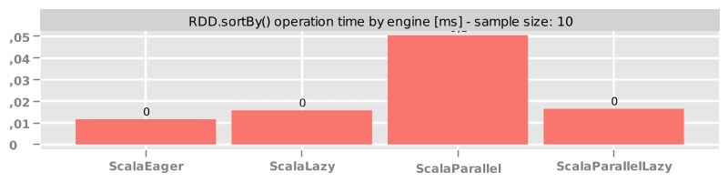

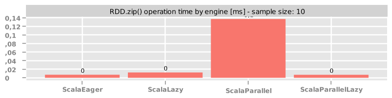

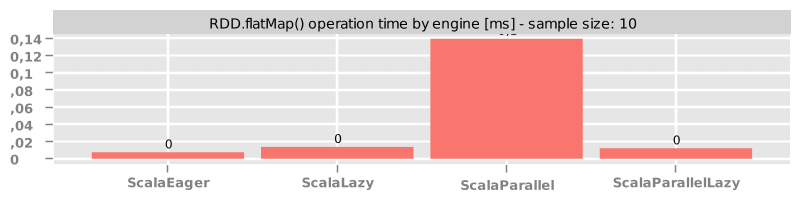

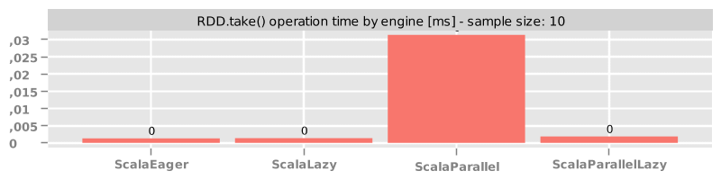

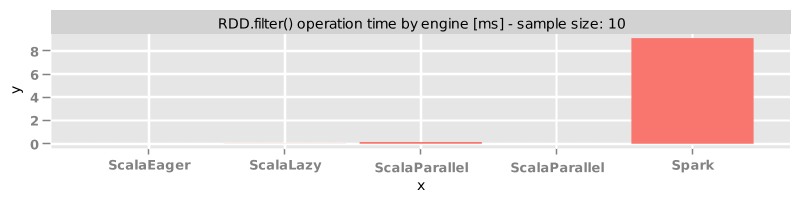

.reduce_10.png)

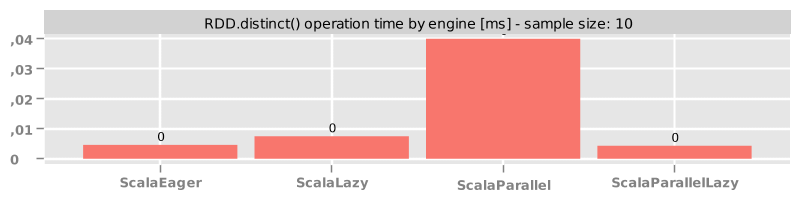

### Sample size = 100 elements

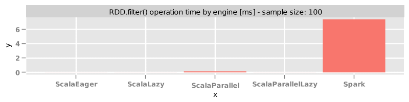

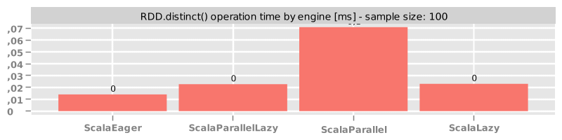

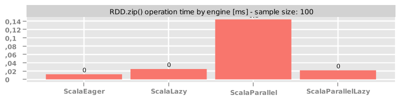

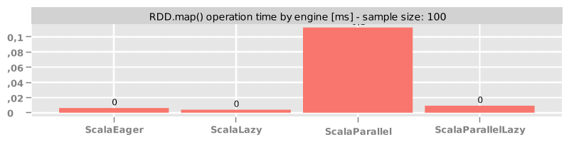

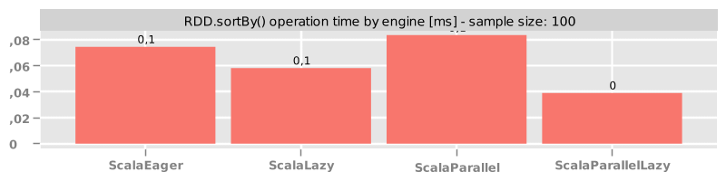

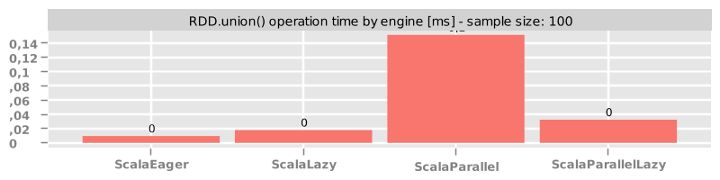

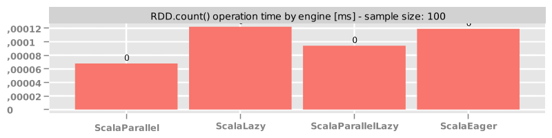

.reduce_100.png)

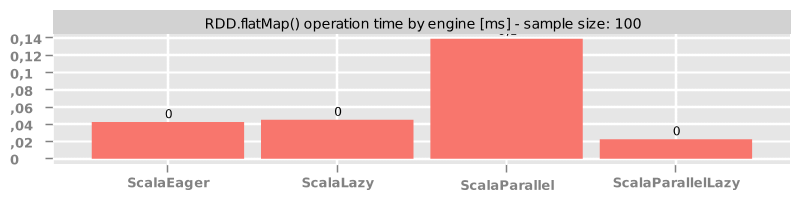

### Sample size = 1000 elements

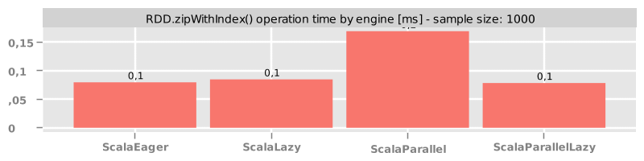

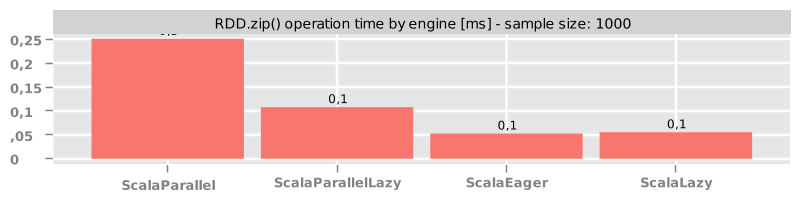

.reduce_1000.png)

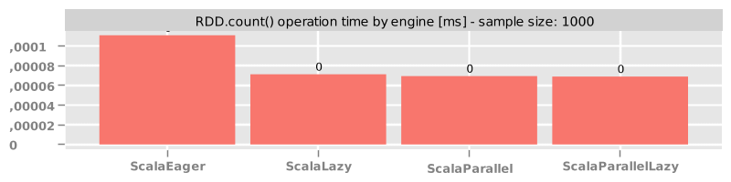

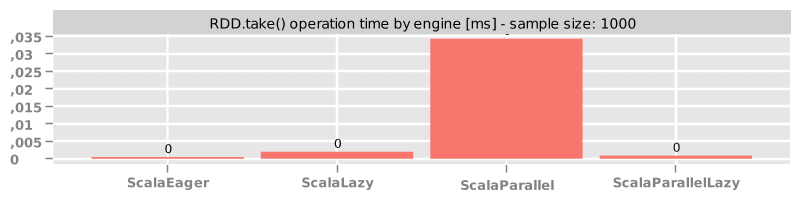

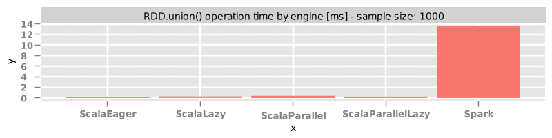

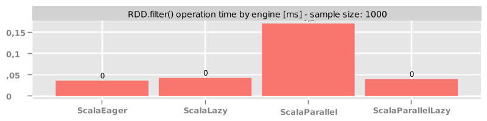

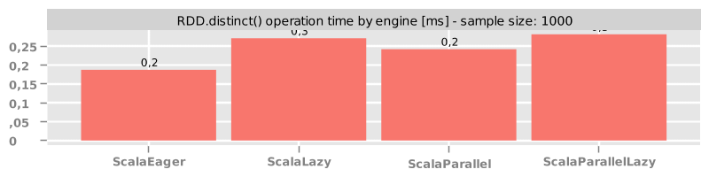

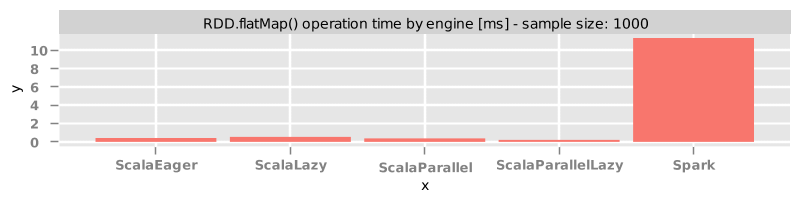

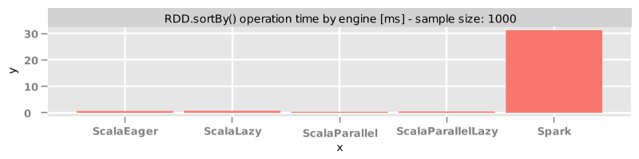

## DataSet

### Sample size = 10 elements

.reduce_10.png)

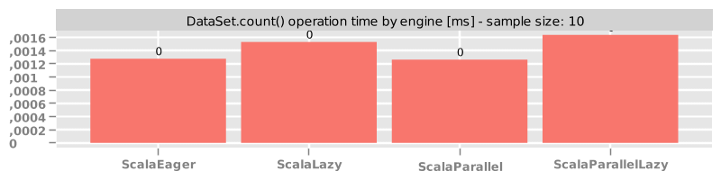

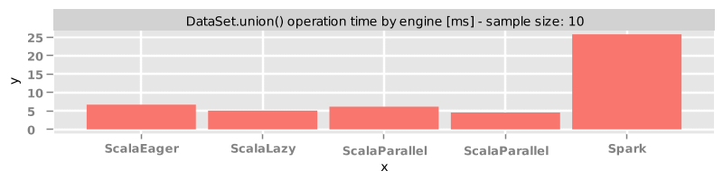

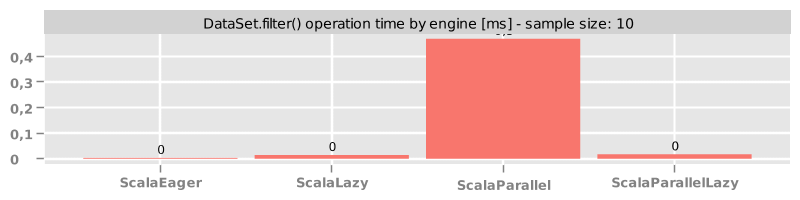

.count_10.png)

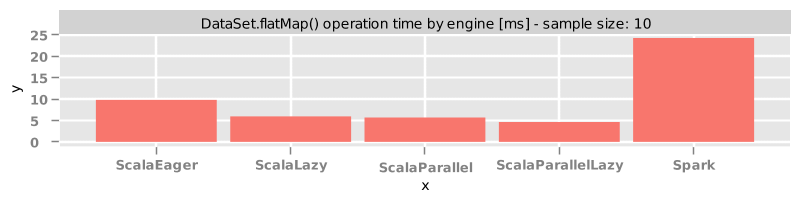

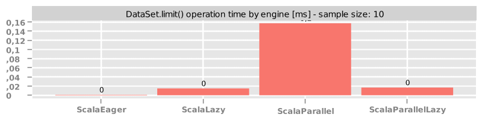

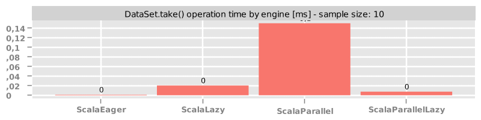

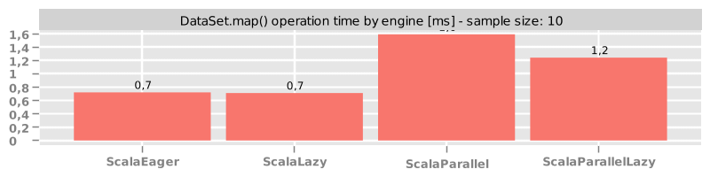

.mapGroups_10.png)

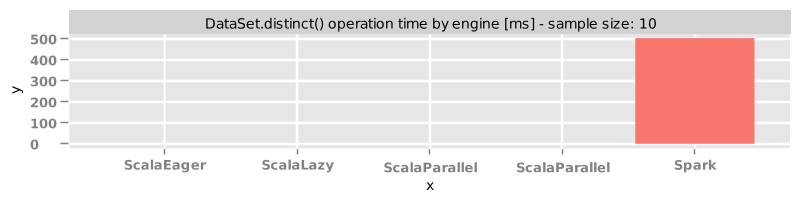

### Sample size = 100 elements

.count_100.png)

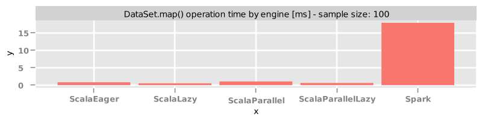

.reduce_100.png)

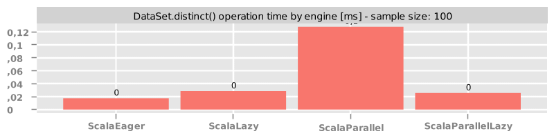

.mapGroups_100.png)

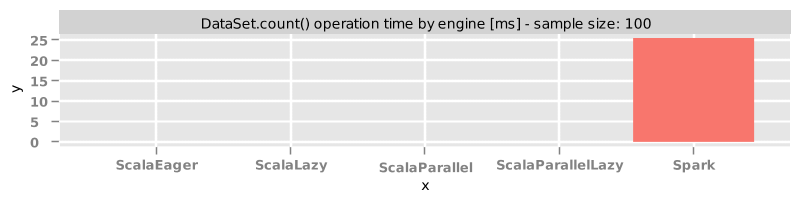

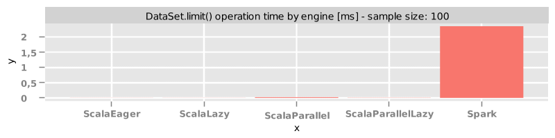

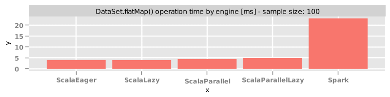

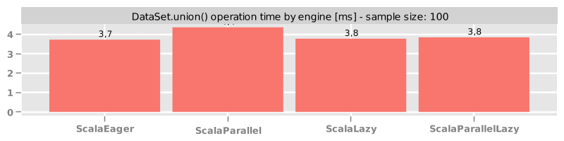

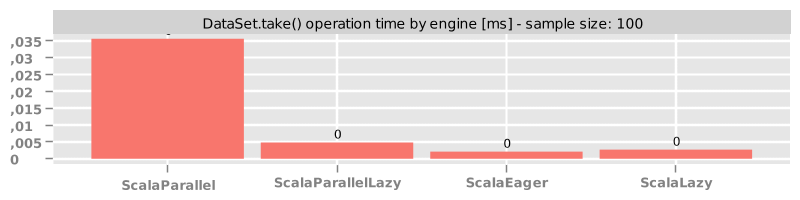

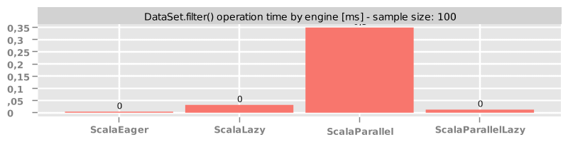

### Sample size = 1000 elements

.count_1000.png)

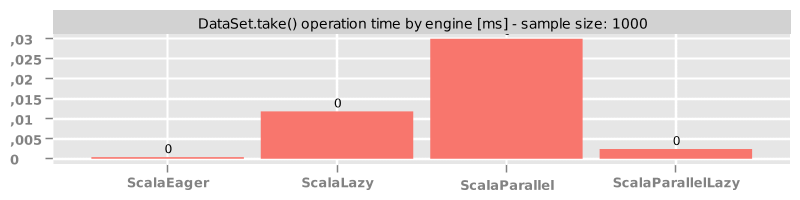

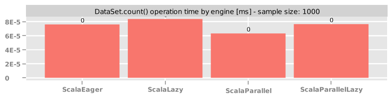

.reduce_1000.png)

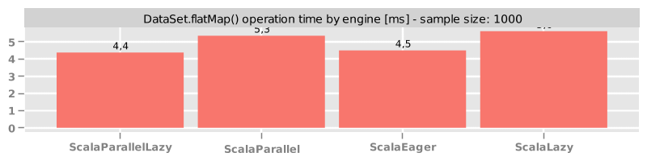

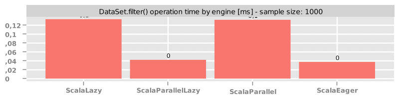

.mapGroups_1000.png)

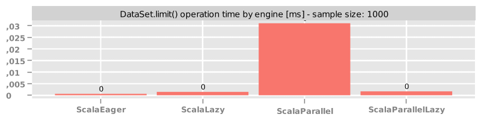

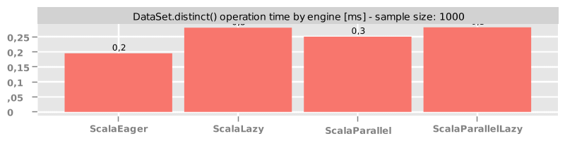

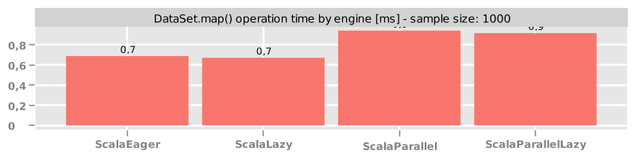

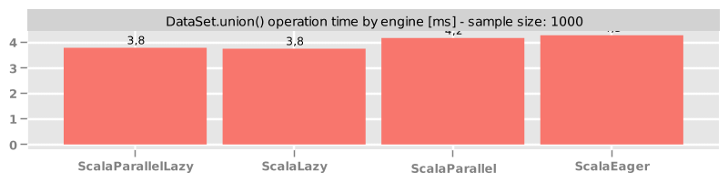

